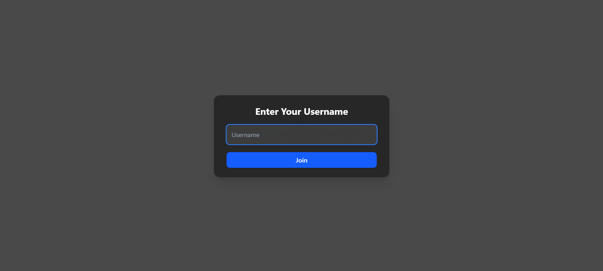
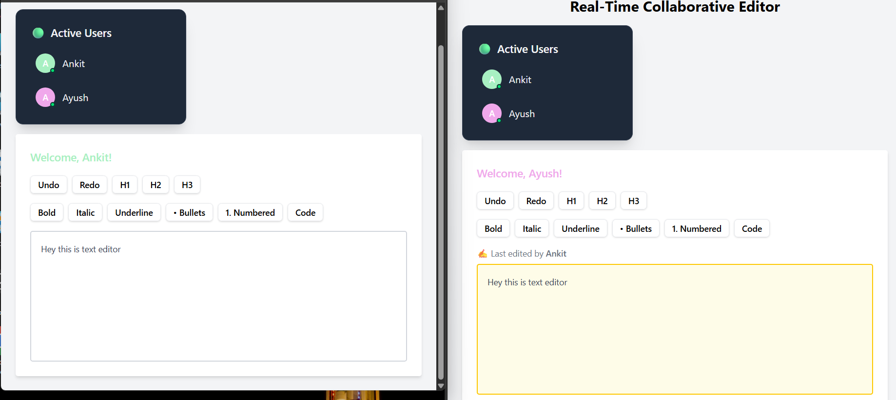

# 📝 Real-Time Collaborative Editor

A web-based rich text editor that allows multiple users to collaborate live, see each other's edits in real time, and view active participants — all built with React, TypeScript, TipTap, Tailwind CSS, and Socket.io.

---

## 🚀 Features

- ✅ Rich text editing (bold, italic, underline, lists, headings, code)
- ✅ Real-time collaboration with live syncing across users
- ✅ Active users panel with color-coded avatars
- ✅ Typing indicators
- ✅ “Last edited by” tracking
- ✅ Highlight when remote changes occur
- ✅ Responsive and clean UI built with Tailwind CSS

---

## 🖼️ Preview

---

## 📦 Tech Stack

- **Frontend**: React, TypeScript, Vite, TipTap, Tailwind CSS
- **Backend**: Node.js, Express, Socket.io
- **Deployment**: Render (client + server separately)

---

## 🛠️ Getting Started Locally

### 1. Clone the Repositories

bash
-> git clone https://github.com/ankitsihag2003/wasserstoff-FrontEndInternTask-1

### 2. Backend Setup
pwsh:
->cd server
->npm install
->node index.js

### 3. Frontend Setup
pwsh:
->cd client
->npm install

### 4. Final Change
-> Change the live links to localhost link

### 5. Good to go
pwsh:
-> npm run dev
